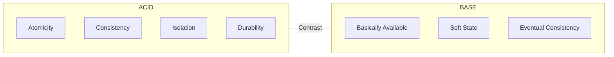

ACID is an acronym that stands for **Atomicity, Consistency, Isolation, Durability**. It's a set of properties for database transactions intended to guarantee validity even in the event of errors, power failures, or other disasters.

## The Four Properties

### Atomicity
Transactions are often composed of multiple statements. Atomicity guarantees that each transaction is treated as a single "unit," which either succeeds completely or fails completely. If any part of a transaction fails, the entire transaction is rolled back and the database is left unchanged.

### Consistency
Consistency ensures that a transaction can only bring the database from one valid state to another, maintaining database invariants. Any data written to the database must be valid according to all defined rules, including constraints, cascades, triggers, and any combination thereof.

### Isolation
Transactions are often executed concurrently (e.g., multiple users reading and writing to the same table). Isolation ensures that concurrent execution of transactions leaves the database in the same state that would have been obtained if the transactions were executed sequentially.

### Durability
Durability guarantees that once a transaction has been committed, it will remain committed even in the case of a system failure (e.g., power outage or crash). This usually means that completed transactions are recorded in non-volatile memory (e.g., on a disk).

## Key Aspects
- **Relevance**: Essential for ensuring data integrity and reliability in banking, e-commerce, and other critical systems.
- **Related Ideas**: [[CAP Theorem]], [[Race Condition]], [[Eventual Consistency]].
- **Analogy**: Imagine a bank transfer. You want to make sure the money is either subtracted from your account AND added to the other person's account, or nothing happens at all (Atomicity).

## Conceptual Diagram: ACID vs Base
