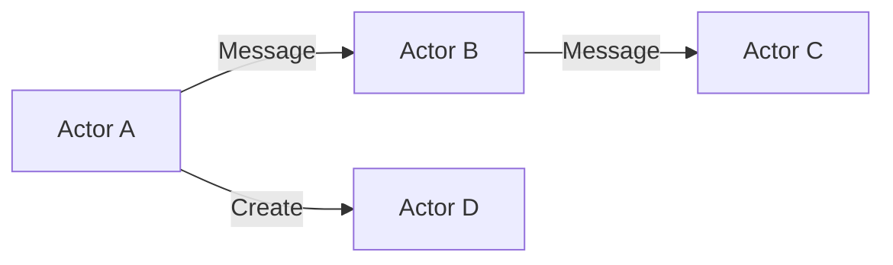

The **Actor Model** is a mathematical model of concurrent computation that treats "actors" as the universal primitive of concurrent computation. In response to a message that it receives, an actor can make local decisions, create more actors, send more messages, and determine how to respond to the next message received.

## Key Principles
1. **Isolation**: Actors have their own private state and can only communicate through asynchronous message passing. They cannot directly modify each other's state.
2. **Asynchronous Messaging**: Communication between actors is done by sending messages that are placed in a mailbox. The sender actor continues its execution after sending a message.
3. **Encapsulation**: Each actor is a self-contained unit of execution, and its state is completely hidden from the outside world.

## Key Aspects
- **Relevance**: Provides a powerful abstraction for building distributed and highly concurrent systems without the complexities of shared memory and manual locking.
- **Related Ideas**: [[Race Condition]], [[Microservices]], [[Backpressure]].
- **Analogy**: Imagine a group of people (actors) who only communicate by sending letters to each other's mailboxes. Each person has their own notebook (state) that only they can read or write to.

## Conceptual Diagram: Actor Communication

## Why use the Actor Model?
- **Concurrency**: Actors can process messages in parallel, making it easier to build systems that scale across multiple cores or machines.
- **Fault Tolerance**: Actors can monitor each other and handle failures gracefully (e.g., using "supervision trees").
- **Scalability**: Since actors are lightweight and communicate asynchronously, it's easier to scale systems by adding more actors or distributing them across multiple nodes.

### Resources
- [The Actor Model (Computerphile)](https://www.youtube.com/watch?v=ELwEdb_pD0k)

