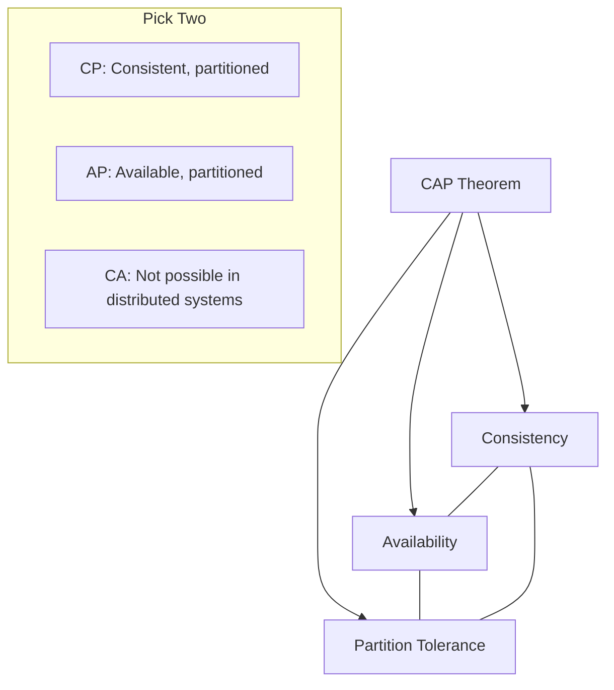

CAP is an acronym for Consistency, Availability, and Partition Tolerance. According to the CAP theorem, any distributed system can only guarantee two of the three properties at any time. You can't guarantee all three properties at once.

- https://www.bmc.com/blogs/cap-theorem/
- https://mwhittaker.github.io/blog/an_illustrated_proof_of_the_cap_theorem/
- https://www.ibm.com/think/topics/cap-theorem

## Consistency

Here's how Gilbert and Lynch describe consistency.

> any read operation that begins after a write operation completes must return that value, or the result of a later write operation

In a consistent system, once a client writes a value to any server and gets a response, it expects to get that value (or a fresher value) back from any server it reads from.

## Availability

Here's how Gilbert and Lynch describe availability.

> every request received by a non-failing node in the system must result in a response

In an available system, if our client sends a request to a server and the server has not crashed, then the server must eventually respond to the client. The server is not allowed to ignore the client's requests.

## Partition Tolerance

Here's how Gilbert and Lynch describe partitions.

> the network will be allowed to lose arbitrarily many messages sent from one node to another

This means that any messages G1 and G2 send to one another can be dropped. If all the messages were being dropped, then our system would look like this.

## The "Pick Two" Principle

Since partitions are a fact of life in distributed systems, we must decide how the system should behave when one occurs. This leaves us with two main options:

1. **CP (Consistency and Partition Tolerance)**: The system chooses consistency over availability. If a partition occurs, some nodes will stop responding to requests to ensure data remains consistent across the surviving nodes.
   - **Examples**: HBase, MongoDB (in some configurations), Redis.
2. **AP (Availability and Partition Tolerance)**: The system chooses availability over consistency. All nodes continue to respond, even if they can't talk to each other, which might lead to different nodes returning different data (eventual consistency).
   - **Examples**: Cassandra, DynamoDB, CouchDB.

*Note: CA (Consistency and Availability) is technically possible only in a single-node system or a network that never fails, which is not realistic for distributed systems.*

## Key Aspects
- **Relevance**: Crucial for designing distributed systems and choosing the right database for a specific use case.
- **Related Ideas**: [[ACID]], [[PACELC Theorem]], [[Eventual Consistency]].
- **Analogy**: Imagine a team of two people (G1 and G2) taking orders. If the phone line between them breaks (Partition), they can either:
    - Stop taking orders to avoid double-booking (Consistency).
    - Keep taking orders separately and try to reconcile later (Availability).

## Conceptual Diagram: CAP Tradeoff
