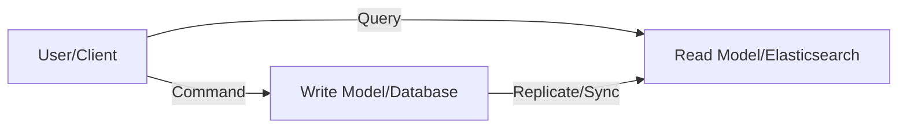

CQRS stands for **Command Query Responsibility Segregation**. It is the notion that you can use a different model to update information than the model you use to read information.

## Key Aspects
- **Relevance**: Helps scale performance and security in complex systems where read and write patterns vary significantly.
- **Related Ideas**: [[Event Sourcing]], [[Dual Write Problem]], [[Outbox Pattern]].
- **Analogy**: Imagine a restaurant. 
	- **The Kitchen (Command side)**: Optimized for cooking (writing/updating).
	- **The Menu (Query side)**: Optimized for reading (viewing).
	- Instead of using the same data structure (the ingredients list) for both, you have separate models (the recipe and the printed menu).

## Why use CQRS?
- **Scaling**: Read and write workloads are often asymmetric. CQRS allows you to scale them independently.
- **Optimization**: You can optimize the write model for consistency and the read model for performance (e.g., using a denormalized view or a search index).
- **Security**: It's easier to ensure that only the right people are modifying data if you separate the commands from the queries.

## Conceptual Diagram: CQRS Architecture

