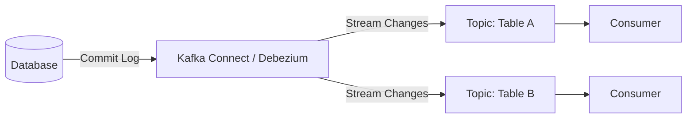

Change Data Capture (CDC) shifts the responsibility from the application to the database log. A tool (like Debezium) monitors the database’s transaction log (e.g., MySQL Binlog or Postgres WAL) and streams changes to other systems.

The application only writes to the DB. The CDC tool "tails" the log and replicates changes asynchronously.
    
- **Tradeoffs:**
    - **Pros:** 
	    - Zero application overhead
	    - handles deletes and schema changes well
	    - highly reliable
    - **Cons:** 
	    - High operational complexity (setting up Kafka Connect/Debezium)
	    - tightly couples your downstream systems to your internal database schema

### When to use it

**Context:** When you need very low latency (near real-time) or need to capture physical "hard" deletes from a source database.

**Solution:** Read directly from the database's commit log (write-ahead log). This stream of events (Insert, Update, Delete) is forwarded to a streaming broker (e.g., Kafka). Tools like Debezium are standard.

**Challenges:**

- **Complexity:** Requires database configuration (e.g., enabling logical replication) and operational access.
- **Data Semantics:** Data is "in motion." Joins between streams must account for time synchronization.

**Debezium Architecture**



**(Python/Spark - Reading Delta Lake CDC):**

```python
# Reading change feed from Delta Lake
events = (spark_session.readStream.format('delta')
          .option('maxFilesPerTrigger', 4)
          .option('readChangeFeed', 'true') # Enable CDC read
          .option('startingVersion', 0)
          .table('events'))

query = events.writeStream.format('console').start()
```