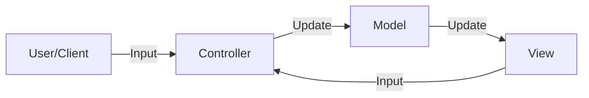

**Model-View-Controller (MVC)** is a pattern used to separate user-interface, data, and application logic. It does this by separating an application into three parts: Model, View, and Controller. 

## The Three Components
1. **Model**: Holds the data and logic of the application. It represents the state of the application and is responsible for managing data updates.
2. **View**: Encompasses the user-interface. It displays data to the user and captures user input.
3. **Controller**: Acts as a mediator between the Model and the View. It receives input from the user and updates the Model or the View accordingly.

## Key Aspects
- **Relevance**: Facilitates the separation of concerns, making applications easier to develop, test, and maintain.
- **Related Ideas**: [[MVP]], [[MVVM]], [[CQRS]].
- **Analogy**: Imagine a TV (View), a remote (Controller), and the TV's internal circuitry (Model). The user interacts with the remote to change the TV's channel (update the Model), and the TV's display (View) is updated to reflect the new channel.

## Conceptual Diagram: MVC Communication
