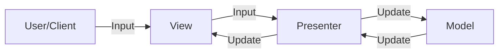

**Model-View-Presenter (MVP)** is a variant of the [[MVC]] pattern designed to ease automated unit testing and improve the separation of concerns in presentation logic. It divides the application into three core components: Model, View, and Presenter. 

## The Three Components
1. **Model**: Similar to MVC, it holds the data and logic of the application.
2. **View**: Represents the user-interface, but unlike MVC, it doesn't interact directly with the Model. Instead, it interacts with the Presenter.
3. **Presenter**: Acts as a mediator between the Model and the View, but with a different relationship than in MVC. It updates the View directly based on changes in the Model.

## Key Aspects
- **Relevance**: Improves testability by decoupling the View from the Model and makes the Presenter the central logic of the application.
- **Related Ideas**: [[MVC]], [[MVVM]].
- **Analogy**: Imagine a news anchor (Presenter) who receives information from a reporter (Model) and then presents it to the audience (View). The news anchor is responsible for processing the information and presenting it in a clear and engaging way.

## Conceptual Diagram: MVP Communication

