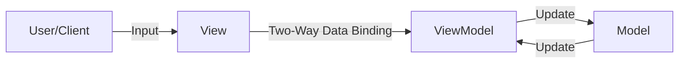

**Model-View-ViewModel (MVVM)** is a variant of the [[MVC]] pattern that separates the application into three core components: Model, View, and ViewModel. It's particularly useful for building applications with complex data binding.

## The Three Components
1. **Model**: Similar to MVC, it holds the data and logic of the application.
2. **View**: Represents the user-interface. It binds directly to the ViewModel's properties and commands.
3. **ViewModel**: Acts as a bridge between the Model and the View. It exposes data and commands from the Model to the View through two-way data binding.

## Key Aspects
- **Relevance**: Simplifies building complex UIs by automating the data-binding process and decoupling the View from the Model.
- **Related Ideas**: [[MVC]], [[MVP]].
- **Analogy**: Imagine a translator (ViewModel) who facilitates communication between two people speaking different languages (Model and View). The translator handles the translation of data and commands, allowing each person to communicate in their own language.

## Conceptual Diagram: MVVM Communication
