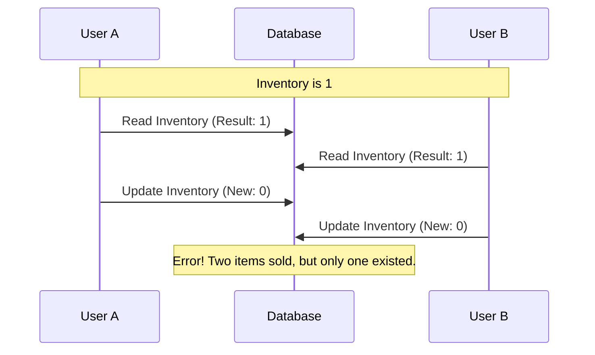

A race condition is a situation where two or more processes depend on the same resources to be available. Sometimes those processes will attempt to modify, or consume, those resources at the same time creating a "race" where one process will have the final say over what the end result is.

Commonly appears in:
- Multithreaded applications 
- Databases

### The Inventory Example
In Databases, you could have a case where two operations want to modify the same records. For example, in the case of e-commerce where 2 customers have the same item in their cart, the inventory of that item needs to be decremented. 

1. **Process A** reads inventory: `1`
2. **Process B** reads inventory: `1`
3. **Process A** decrements and writes: `0`
4. **Process B** decrements and writes: `0`

Both customers "bought" the item, but only one was actually in stock. This leads to **overselling**.

## Key Aspects
- **Relevance**: Race conditions lead to data corruption, inconsistent state, and hard-to-reproduce bugs ("Heisenbugs").
- **Related Ideas**: [[ACID#Isolation|Isolation]], [[Load Balancing]], [[Actors]].
- **Analogy**: Imagine two people trying to sit in the last chair at the same time. If they both see it's empty and move at once, they might collide or one might end up on the other's lap.
- **Best Practices**:
	- Use **Atomic Operations** (Compare-and-Swap).
	- Use **Locks** (Pessimistic or Optimistic).
	- Use **Idempotency** keys to ensure operations are only performed once.

## Conceptual Diagram: Race Condition Flow

 