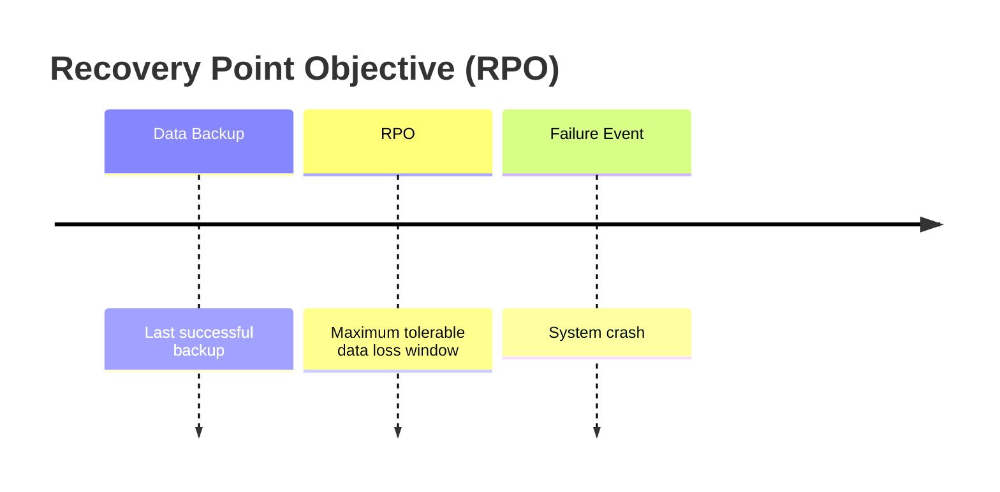

Recovery Point Objective (RPO) measures the maximum acceptable amount of data loss, expressed as the time between the last backup and a failure event—such as minutes or hours of potential data forfeiture.

## Key Aspects
- **Relevance**: Crucial for defining data backup and disaster recovery strategies.
- **Related Ideas**: [[Recovery Time Objective]], [[Durability]].
- **Analogy**: Imagine you are writing a book and saving it every hour. If your computer crashes, your RPO is 1 hour—that's the maximum amount of work you're willing to lose.

## RPO in Action
If you are unable to lose even a single record/event you should look for solutions that have `RPO = 0`. This often requires synchronous replication or real-time CDC.

## Conceptual Diagram: RPO Visualization

