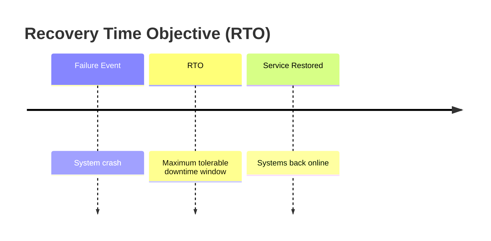

Recovery Time Objective (RTO) defines the maximum tolerable downtime before systems must resume operations, focusing on how quickly recovery occurs after disruption.

## Key Aspects
- **Relevance**: Crucial for defining service level agreements (SLAs) and ensuring business continuity.
- **Related Ideas**: [[Recovery Point Objective]], [[Availability]].
- **Analogy**: Imagine your car breaks down. Your RTO is the amount of time it takes to get it back on the road. If you have a critical meeting, your RTO might be 15 minutes.

## RTO in Action
`RTO = 0` is very expensive to maintain, usually systems will have to accept some level of downtime and provide an SLA. Achieving a low RTO often involves automated failover and high-availability (HA) clusters.

## Conceptual Diagram: RTO Visualization

 