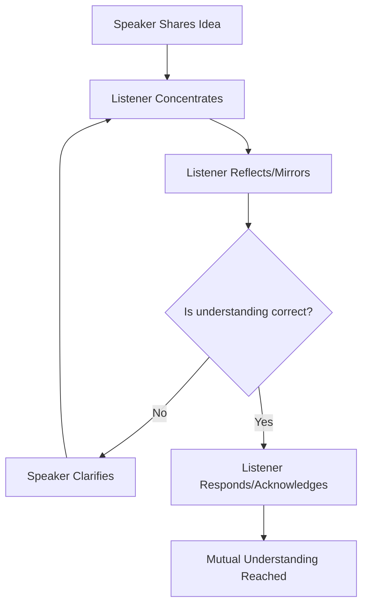

Active listening is a communication technique that involves fully concentrating, understanding, responding, and then remembering what is being said. In the context of engineering leadership, it is about moving beyond hearing words to understanding the underlying intent, concerns, and ideas of team members, particularly in remote or asynchronous environments.

Key Aspects:
- **Why is this concept relevant?**
    - High-stakes environments: Engineering often involves complex trade-offs where missing a detail can lead to significant technical debt or system failure.
    - Remote Work: In async/remote settings, non-verbal cues are lost. Active listening (and its written equivalent, active reading) ensures alignment.
    - Psychological Safety: When team members feel heard, they are more likely to share risks and innovative ideas.
- **What ideas does the concept relate to?**
    - [[mentorship/Empathy|Empathy]]
    - [[mentorship/Coaching|Coaching]]
    - [[communication/Stakeholder Management|Stakeholder Management]]
    - Psychological Safety
- **Patterns to assist in understanding:**
    - **The Mirroring Pattern:** Repeating back what you heard in your own words to confirm understanding ("So, if I understand correctly, you're concerned that the new schema will increase latency for our write-heavy workloads?").
    - **The Inquiry Pattern:** Asking open-ended questions instead of providing immediate solutions ("Can you tell me more about how you reached that conclusion?").
- **Analogy:**
    - Active listening is like **TCP (Transmission Control Protocol)**. It’s not just about sending packets of information; it’s about a two-way handshake, acknowledgment (ACK), and ensuring the message was received correctly and in the right order before proceeding.
- **Best Practices:**
    - Minimize distractions during sync meetings (close Slack/email).
    - Use "I" statements to reflect back ("I'm hearing that...").
    - Pay attention to non-verbal cues (in video calls).
    - In async (Slack/PRs), use clarifying questions before disagreeing.

Fundamentals or Prerequisites:
- Basic Communication Skills
- [[mentorship/Empathy|Empathy]]
- Emotional Intelligence (EQ)

Conceptual Diagram: The Active Listening Loop

