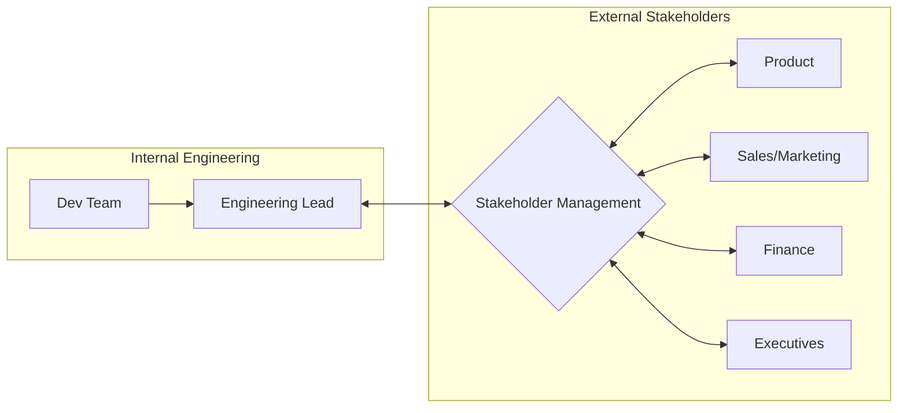

Stakeholder management is the systematic process of identifying, analyzing, and engaging with individuals or groups who have an interest in or can influence the outcome of engineering projects. For engineering leaders, this means acting as a bridge between technical teams and the wider organization (Product, Sales, Finance, Executive leadership).

Key Aspects:
- **Why is this concept relevant?**
    - **Resource Allocation:** Securing budget, headcount, and tools requires buy-in from non-technical leaders.
    - **Alignment:** Ensures engineering effort is directed toward business value and that non-technical stakeholders understand technical constraints.
    - **Risk Mitigation:** Identifying potential blockers or conflicting priorities early in the project lifecycle.
- **What ideas does the concept relate to?**
    - [[communication/Translating Tech to Business|Translating Tech to Business]]
    - [[strategy/Prioritization|Prioritization]]
    - [[project management/Managing Dependencies|Managing Dependencies]]
    - Influence without Authority
- **Patterns to assist in understanding:**
    - **Power/Interest Grid:** A matrix for categorizing stakeholders based on their power to influence and their level of interest. This determines the engagement strategy (e.g., Manage Closely, Keep Informed).
    - **The Feedback Loop Pattern:** Establishing regular Cadences (Steering Committees, Demos, Status Reports) to keep stakeholders updated.
- **Analogy:**
    - Stakeholder management is like **API Versioning**. You have multiple "consumers" (stakeholders) with different requirements and expectations. You need to provide a stable "interface" (communication channel) while managing breaking changes (delays, scope shifts) in a way that doesn't "break" the relationship.
- **Best Practices:**
    - Identify stakeholders early (before the project starts).
    - Tailor communication style and frequency to the specific stakeholder.
    - Be transparent about risks and trade-offs.
    - Use data and business metrics (ROI, Latency impact on conversion) to support technical requests.

Fundamentals or Prerequisites:
- [[communication/Active Listening|Active Listening]]
- [[communication/Translating Tech to Business|Translating Tech to Business]]
- Emotional Intelligence (EQ)

Conceptual Diagram: The Engineering Bridge

