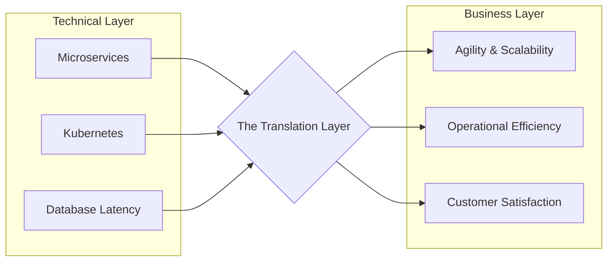

Translating tech to business is the skill of reframing complex technical information—such as system architecture, technical debt, or scalability constraints—into terms of business value, risk, and impact. It is a core competency for senior engineers and engineering leaders who must influence non-technical decision-makers.

Key Aspects:
- **Why is this concept relevant?**
    - **Resource Negotiation:** Business leaders make decisions based on ROI, cost-benefit analysis, and risk. To get resources, you must speak their language.
    - **Shared Understanding:** Miscommunication between engineering and the business leads to unrealistic timelines and poor product-market fit.
    - **Prioritizing Tech Debt:** Explaining why refactoring matters in terms of "future feature velocity" or "system reliability (uptime)" instead of just "cleaner code."
- **What ideas does the concept relate to?**
    - [[communication/Stakeholder Management|Stakeholder Management]]
    - [[strategy/Measuring Outcomes|Measuring Outcomes]]
    - [[project management/Risk Assessment|Risk Assessment]]
- **Patterns to assist in understanding:**
    - **The Impact-Metric Mapping:** Connect technical metrics to business metrics.
        - *Latency (ms)* -> *User Conversion/Retention (%)*
        - *Bug Count* -> *Customer Support Tickets/Churn ($)*
        - *Tech Debt (Refactoring)* -> *Time to Market (Speed)*
    - **The Risk-Language Pattern:** Describe technical issues as business risks (financial, reputational, or legal).
- **Analogy:**
    - Translating tech to business is like **compiling code to machine-readable format**. The engineering team writes the "source code" (high-level technical work), but the "operating system" (the business) only executes on specific instructions like "profit," "risk," and "efficiency." You are the compiler that ensures the intent is correctly translated into actionable business logic.
- **Best Practices:**
    - Avoid jargon (e.g., instead of "sharding," say "splitting data across multiple servers to handle more users").
    - Lead with the "Why" (the business outcome) before the "How" (the technical implementation).
    - Use analogies that resonate with non-technical audiences.
    - Visualize with simple, non-technical diagrams.

Fundamentals or Prerequisites:
- [[communication/Active Listening|Active Listening]]
- Basic understanding of business operations (P&L, CAC, LTV)
- [[strategy/Measuring Outcomes|Measuring Outcomes]]

Conceptual Diagram: Translation Layer

