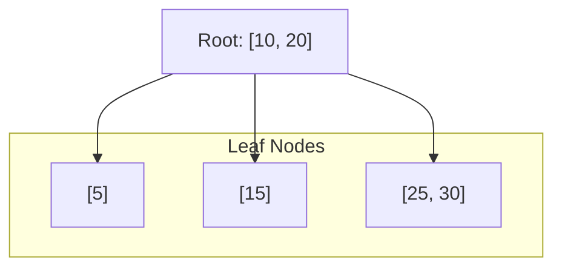

# B-Tree

A B-tree is a self-balancing, multi-way search tree data structure that maintains sorted data and allows for efficient searches, sequential access, insertions, and deletions. It is particularly well-suited for systems that read and write large blocks of data, such as databases and file systems, because it minimizes the number of disk accesses.

Unlike a [[Binary Search Tree]], where each node can have at most two children, a B-tree node can have many children (defined by the tree's **order** or **degree**). This allows the tree to remain very "flat," keeping the path from the root to any leaf extremely short.

## Key Aspects

- **Why is this relevant?** B-trees are the backbone of modern database indexing (like PostgreSQL and MySQL) and file systems (like NTFS and HFS+). They are designed to work efficiently with secondary storage (HDDs/SSDs) by matching the node size to the storage block size.
- **Related Concepts:** [[Binary Search Tree]], [[Hash Table]], [[B+ Tree]] (a common variation).
- **Patterns:**
    - **Node Splitting:** When a node exceeds its maximum capacity, it splits into two, and the median element is pushed up to the parent.
    - **Node Merging:** When a node's occupancy drops below a threshold, it may be merged with a sibling to maintain balance.
- **Analogy:** Think of a B-tree as a **library catalog system**. Instead of looking through individual books (nodes), you look at a drawer (node) that contains many index cards (keys). Each card points you to a specific shelf (child) where you can find more drawers or the actual books.
- **Best Practices:**
    - Choose an order (m) that allows a node to fit exactly into a single disk block or page.
    - Use B-trees when data is too large to fit entirely in main memory (RAM).

## Fundamentals

- **Balanced Tree:** Every leaf is at the same depth, ensuring predictable performance.
- **Order (m):** The maximum number of children a node can have. A node with *n* keys has *n+1* children.
- **Sorted Keys:** Within each node, keys are kept in increasing order for efficient searching.

## Specifications

| Operation | Average Complexity | Worst Case Complexity |
| :--- | :--- | :--- |
| Search | O(log n) | O(log n) |
| Insertion | O(log n) | O(log n) |
| Deletion | O(log n) | O(log n) |
| Space | O(n) | O(n) |

*Note: The base of the logarithm for B-trees is the degree of the tree (m), which is typically much larger than 2, making the tree very shallow compared to a BST.*

## Conceptual Diagram: B-Tree Structure

## B-Tree vs. B+ Tree

| Feature | B-Tree | B+ Tree |
| :--- | :--- | :--- |
| Data Storage | Data stored in both internal and leaf nodes. | Data stored **only** in leaf nodes. |
| Search Performance | Can be faster if data is found in an internal node. | Consistent search time as all data is at leaves. |
| Range Queries | Harder (requires tree traversal). | Very efficient (leaves are linked together). |
| Leaf Links | No links between leaf nodes. | Leaf nodes are linked in a list. |
