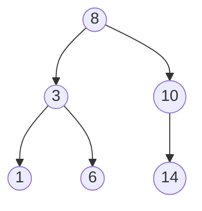

# Binary Search Tree (BST)

A Binary Search Tree is a hierarchical data structure where each node has at most two children, referred to as the left child and the right child. For every node, all elements in its left subtree are smaller than the node's value, and all elements in its right subtree are larger. This property makes it highly efficient for searching, as it allows for a binary search-like process.

## Key Aspects

- **Why is this relevant?** BSTs provide a middle ground between ordered arrays (fast search, slow insert/delete) and unordered linked lists (slow search, fast insert/delete). They are the foundation for more advanced structures like [[B-Tree]], AVL trees, and Red-Black trees.
- **Related Concepts:** [[algorithms/Binary Search]], [[Linked Lists]], [[B-Tree]], [[Heap Sort]].
- **Patterns:**
    - **In-order Traversal:** Visiting nodes in a (Left, Root, Right) sequence produces values in non-decreasing order.
    - **Recursion:** Most tree operations (search, insert, delete) are naturally recursive.
- **Analogy:** Imagine a **sorted directory** where every person's name (node) points you to two other lists: one for people with names earlier in the alphabet (left) and one for names later in the alphabet (right).
- **Best Practices:**
    - Always consider the "worst case" (a skewed tree), which behaves like a [[Linked Lists]].
    - For production systems, use **Self-Balancing BSTs** (like AVL or Red-Black trees) to guarantee O(log n) performance.

## Fundamentals

- **The BST Property:** `Left < Node < Right`.
- **Traversals:**
    - **Pre-order (Root, Left, Right):** Useful for creating a copy of the tree.
    - **In-order (Left, Root, Right):** Gives sorted output.
    - **Post-order (Left, Right, Root):** Useful for deleting the tree or evaluating postfix expressions.
- **Successor/Predecessor:** Finding the next smallest or largest node relative to a given value.

## Specifications

| Operation | Average Complexity | Worst Case Complexity (Skewed) |
| :--- | :--- | :--- |
| Search | O(log n) | O(n) |
| Insertion | O(log n) | O(n) |
| Deletion | O(log n) | O(n) |
| Space | O(n) | O(n) |

## Implementation

```ts
class BSTNode {
    value: number;
    left: BSTNode | null = null;
    right: BSTNode | null = null;

    constructor(value: number) {
        this.value = value;
    }
}

function insert(root: BSTNode | null, value: number): BSTNode {
    if (!root) return new BSTNode(value);

    if (value < root.value) {
        root.left = insert(root.left, value);
    } else if (value > root.value) {
        root.right = insert(root.right, value);
    }
    return root;
}

function search(root: BSTNode | null, target: number): boolean {
    if (!root) return false;
    if (root.value === target) return true;

    return target < root.value 
        ? search(root.left, target) 
        : search(root.right, target);
}
```

## Conceptual Diagram: BST Structure


