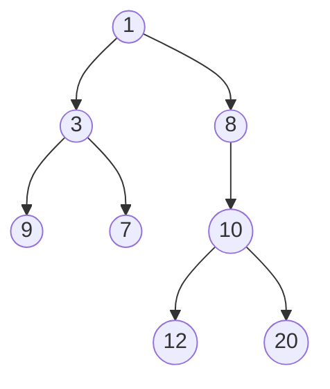

# Cartesian Tree

A Cartesian Tree is a unique binary tree derived from a sequence of numbers that satisfies two primary properties:
1.  **Symmetric Order (In-order):** An in-order traversal of the tree results in the original sequence.
2.  **Heap Property:** Each node's value is either greater than (Max-Heap) or less than (Min-Heap) the values of its children.

For any given sequence of distinct numbers, there is exactly one unique Cartesian Tree that satisfies these properties.

## Key Aspects

-   **Why is this relevant?** Cartesian Trees are the foundation for solving **Range Minimum Query (RMQ)** problems efficiently. They are also used in building **Treaps** (a combination of a BST and a Heap) and for finding the **Lowest Common Ancestor (LCA)**.
-   **Related Concepts:** [[Binary Search Tree]], [[Stack]], [[Heap Sort]], [[Binary Search Tree]].
-   **Patterns:**
    -   **Right-Spine Construction:** A linear-time O(n) algorithm exists that uses a stack to maintain the "right-most spine" of the tree.
-   **Analogy:** Imagine a **landscape profile** (the sequence). The highest peaks are the roots of the tree (Max-Heap), and each peak divides the landscape into left and right sub-regions, which are then processed recursively.
-   **Best Practices:**
    -   Use a monotonic stack for O(n) construction.
    -   Use Cartesian trees for RMQ problems when pre-processing time is available to achieve O(1) query time.

## Fundamentals

-   **Construction Algorithm:**
    1.  Maintain a stack of nodes representing the right-most path of the tree.
    2.  For each new element in the sequence, pop nodes from the stack that are larger than the current element (for a Min-Heap).
    3.  The last popped node becomes the left child of the new node.
    4.  The new node becomes the right child of the node currently at the top of the stack.
    5.  Push the new node onto the stack.

## Specifications

| Operation | Complexity |
| :--- | :--- |
| Construction | O(n) |
| Search | O(n) (Not optimized for searching) |
| In-order Traversal | O(n) |
| Range Minimum Query | O(1) (After O(n) pre-processing) |

## Implementation (Min-Heap)

```ts
class CartesianNode {
    value: number;
    left: CartesianNode | null = null;
    right: CartesianNode | null = null;

    constructor(value: number) {
        this.value = value;
    }
}

function buildCartesianTree(sequence: number[]): CartesianNode | null {
    if (sequence.length === 0) return null;

    const stack: CartesianNode[] = [];

    for (const val of sequence) {
        let lastPopped: CartesianNode | null = null;
        const newNode = new CartesianNode(val);

        // Maintain Min-Heap property
        while (stack.length > 0 && stack[stack.length - 1].value > val) {
            lastPopped = stack.pop()!;
        }

        if (lastPopped) {
            newNode.left = lastPopped;
        }

        if (stack.length > 0) {
            stack[stack.length - 1].right = newNode;
        }

        stack.push(newNode);
    }

    return stack[0]; // The root is the first element pushed that wasn't popped
}
```

## Conceptual Diagram: Sequence [9, 3, 7, 1, 8, 12, 10, 20] (Min-Heap)


