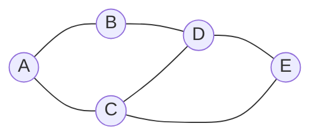

# Graph

A Graph is a non-linear data structure consisting of a finite set of **vertices** (or nodes) and a set of **edges** that connect pairs of vertices. Graphs are used to represent complex relationships between objects.

Unlike trees, which are a specific type of acyclic graph, general graphs can contain cycles and multiple paths between any two nodes.

## Key Aspects

- **Why is this relevant?** Graphs are ubiquitous in computer science. They model social networks (Facebook/LinkedIn), routing and navigation (Google Maps), web indexing (PageRank), and dependency resolution (npm/cargo).
- **Related Concepts:** [[Linked Lists]], [[Queue]] (for BFS), [[Stack]] (for DFS), [[Heap Sort]] (for Dijkstra's algorithm).
- **Patterns:**
    - **Adjacency List:** An array of lists where each list describes the neighbors of a vertex. Highly space-efficient for sparse graphs.
    - **Adjacency Matrix:** A 2D array where the value at `[i][j]` indicates an edge between vertex `i` and `j`. Fast lookups but O(V²) space.
- **Analogy:** Think of a **map of cities**. Each city is a vertex, and the roads connecting them are edges. Some roads might be one-way (Directed), and some might have tolls or distances (Weighted).
- **Best Practices:**
    - Prefer **Adjacency Lists** for most real-world applications (sparse graphs).
    - Always track "visited" nodes during traversal to avoid infinite loops in cyclic graphs.

## Fundamentals

- **Directed vs. Undirected:** Do edges have a direction (one-way vs. two-way)?
- **Weighted vs. Unweighted:** Do edges have associated costs or values?
- **Cyclic vs. Acyclic:** Can you return to a node by following a sequence of edges?
- **Connectivity:** Is there a path between every pair of vertices?

## Specifications (Adjacency List)

| Operation | Complexity |
| :--- | :--- |
| Add Vertex | O(1) |
| Add Edge | O(1) |
| Remove Vertex | O(V + E) |
| Remove Edge | O(E) |
| Search (BFS/DFS) | O(V + E) |
| Space | O(V + E) |

## Implementation (Adjacency List)

```ts
class Graph<T> {
    private adjacencyList: Map<T, T[]> = new Map();

    addVertex(vertex: T): void {
        if (!this.adjacencyList.has(vertex)) {
            this.adjacencyList.set(vertex, []);
        }
    }

    addEdge(v1: T, v2: T, directed: boolean = false): void {
        this.addVertex(v1);
        this.addVertex(v2);
        this.adjacencyList.get(v1)?.push(v2);
        if (!directed) {
            this.adjacencyList.get(v2)?.push(v1);
        }
    }

    bfs(start: T): T[] {
        const queue: T[] = [start];
        const result: T[] = [];
        const visited: Set<T> = new Set([start]);

        while (queue.length) {
            const vertex = queue.shift()!;
            result.push(vertex);

            this.adjacencyList.get(vertex)?.forEach(neighbor => {
                if (!visited.has(neighbor)) {
                    visited.add(neighbor);
                    queue.push(neighbor);
                }
            });
        }
        return result;
    }
}
```

## Conceptual Diagram: Undirected Graph


