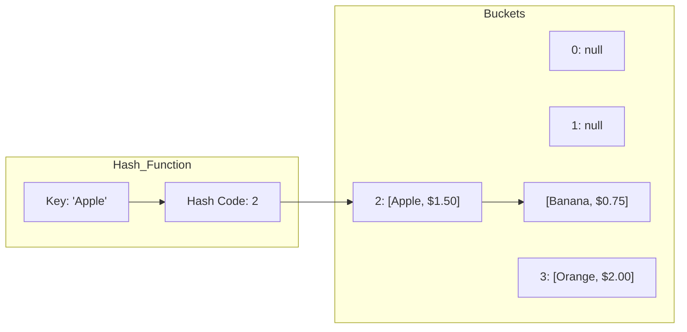

# Hash Table

A Hash Table (also known as a Hash Map or Dictionary) is a data structure that maps keys to values using a **hash function** to compute an index into an array of buckets or slots. From this index, the desired value can be found.

It is one of the most powerful and frequently used data structures due to its ability to provide **average O(1)** time complexity for searching, inserting, and deleting elements.

## Key Aspects

- **Why is this relevant?** Hash tables are essential for building high-performance systems. They are used for database indexing, caching (like Redis), implementing sets, and solving a vast majority of algorithmic problems that require fast lookups.
- **Related Concepts:** [[Arrays]], [[Linked Lists]], [[Binary Search Tree]].
- **Patterns:**
    - **Frequency Counting:** Using a hash table to count occurrences of elements in a list.
    - **Caching/Memoization:** Storing results of expensive function calls to avoid redundant computations.
    - **Existence Check:** Quickly determining if a value exists in a collection.
- **Analogy:** Imagine a **post office box system**. You have a key (the input key), a mathematical rule (the hash function) that tells you exactly which box number to go to, and you find your mail (the value) inside that box.
- **Best Practices:**
    - Choose a good hash function that distributes keys uniformly to minimize collisions.
    - Monitor the **Load Factor** (number of elements / number of buckets) and resize the table when it exceeds a threshold (typically 0.7 or 0.75).

## Fundamentals

- **Hash Function:** Converts a key into a numeric index. A "good" hash function is fast and reduces the probability of collisions.
- **Collision Handling:** Since different keys can hash to the same index, we need strategies to handle them:
    - **Separate Chaining:** Each bucket contains a [[Linked Lists]] of all elements that hashed to that index.
    - **Open Addressing:** If a collision occurs, the algorithm searches for the next available slot (Linear Probing, Quadratic Probing, or Double Hashing).
- **Load Factor ($\alpha$):** The ratio of the number of stored entries to the number of slots in the table. High load factors lead to more collisions and slower performance.

## Specifications

| Operation | Average Complexity | Worst Case Complexity |
| :--- | :--- | :--- |
| Search | O(1) | O(n) (When many collisions occur) |
| Insertion | O(1) | O(n) |
| Deletion | O(1) | O(n) |
| Space | O(n) | O(n) |

## Implementation (Separate Chaining)

```ts
class HashTable<K, V> {
    private table: Array<Array<[K, V]>>;
    private size: number;

    constructor(size: number = 10) {
        this.size = size;
        this.table = new Array(size).fill(null).map(() => []);
    }

    private hash(key: string): number {
        let hash = 0;
        for (let i = 0; i < key.length; i++) {
            hash = (hash << 5) + key.charCodeAt(i);
            hash = hash & hash; // Convert to 32bit integer
            hash = Math.abs(hash);
        }
        return hash % this.size;
    }

    set(key: K, value: V): void {
        const index = this.hash(String(key));
        const bucket = this.table[index];
        
        for (let i = 0; i < bucket.length; i++) {
            if (bucket[i][0] === key) {
                bucket[i][1] = value;
                return;
            }
        }
        bucket.push([key, value]);
    }

    get(key: K): V | undefined {
        const index = this.hash(String(key));
        const bucket = this.table[index];
        
        for (const [k, v] of bucket) {
            if (k === key) return v;
        }
        return undefined;
    }
}
```

## Conceptual Diagram: Separate Chaining


