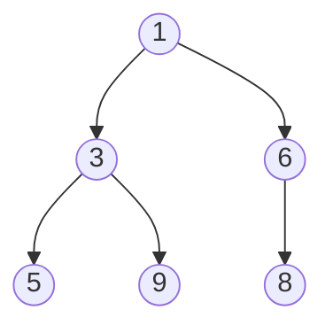

# Heap

A Heap is a specialized tree-based data structure that satisfies the **heap property**. It is a complete binary tree, meaning all levels are fully filled except possibly the last, which is filled from left to right.

There are two main types of heaps:
1.  **Max-Heap:** The value of each node is greater than or equal to the values of its children. The root is the maximum element.
2.  **Min-Heap:** The value of each node is less than or equal to the values of its children. The root is the minimum element.

## Key Aspects

- **Why is this relevant?** Heaps are primarily used to implement **Priority Queues**, which are essential for scheduling tasks (OS), Dijkstra's shortest path algorithm, and Prim's minimum spanning tree algorithm. They are also the basis for [[Heap Sort]].
- **Related Concepts:** [[Queue]], [[Arrays]], [[Heap Sort]], [[Binary Search Tree]].
- **Patterns:**
    - **Heapify:** The process of creating a heap from an unordered array.
    - **Extract Min/Max:** Removing the root and restoring the heap property (O(log n)).
- **Analogy:** Imagine a **corporate hierarchy**. In a Max-Heap, the CEO (root) has the highest "value" (authority), and every manager has more authority than their direct reports. In a Min-Heap, it might be like a **golf tournament leaderboard**, where the person with the lowest score is at the top.
- **Best Practices:**
    - Heaps are typically implemented using an [[Arrays]] for space efficiency and fast parent/child index calculations.
    - Use a Heap when you need constant-time access to the largest or smallest element in a dynamic set of data.

## Fundamentals

- **Complete Binary Tree:** A binary tree where every level is full, except possibly the last level which is filled from left to right.
- **Array Representation:** For a node at index `i`:
    - **Left Child:** `2i + 1`
    - **Right Child:** `2i + 2`
    - **Parent:** `floor((i - 1) / 2)`
- **Heapify Up (Sift Up):** Used after insertion to restore the heap property by moving the element up.
- **Heapify Down (Sift Down):** Used after extraction to restore the heap property by moving the new root down.

## Specifications

| Operation | Complexity |
| :--- | :--- |
| Find Min/Max | O(1) |
| Insert | O(log n) |
| Delete (Extract) | O(log n) |
| Heapify (Build) | O(n) |
| Space | O(n) |

## Implementation (Min-Heap)

```ts
class MinHeap {
    private heap: number[] = [];

    insert(val: number): void {
        this.heap.push(val);
        this.bubbleUp();
    }

    extractMin(): number | null {
        if (this.heap.length === 0) return null;
        if (this.heap.length === 1) return this.heap.pop()!;

        const min = this.heap[0];
        this.heap[0] = this.heap.pop()!;
        this.bubbleDown();
        return min;
    }

    private bubbleUp(): void {
        let index = this.heap.length - 1;
        while (index > 0) {
            let parentIndex = Math.floor((index - 1) / 2);
            if (this.heap[index] >= this.heap[parentIndex]) break;
            [this.heap[index], this.heap[parentIndex]] = [this.heap[parentIndex], this.heap[index]];
            index = parentIndex;
        }
    }

    private bubbleDown(): void {
        let index = 0;
        const length = this.heap.length;
        while (true) {
            let left = 2 * index + 1;
            let right = 2 * index + 2;
            let smallest = index;

            if (left < length && this.heap[left] < this.heap[smallest]) smallest = left;
            if (right < length && this.heap[right] < this.heap[smallest]) smallest = right;
            if (smallest === index) break;

            [this.heap[index], this.heap[smallest]] = [this.heap[smallest], this.heap[index]];
            index = smallest;
        }
    }
}
```

## Conceptual Diagram: Min-Heap Structure


