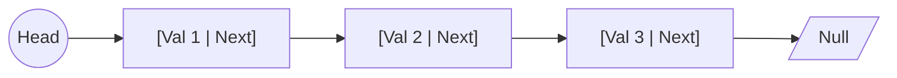

# Linked Lists

A Linked List is a linear data structure where elements, called **nodes**, are not stored in contiguous memory locations. Instead, each node contains a value and a **pointer** (or reference) to the next node in the sequence.

This structure allows for efficient insertions and deletions at any point in the list, but it requires sequential access for searching or indexing.

## Key Aspects

- **Why is this relevant?** Linked Lists are fundamental for implementing more complex structures like [[Queue]], [[Stack]], and even [[Hash Table]] (for collision handling). They are also used in scenarios where data size is unpredictable or frequent insertions/deletions occur.
- **Related Concepts:** [[Arrays]], [[Stack]], [[Queue]], [[Hash Table]].
- **Patterns:**
    - **Fast & Slow Pointers:** Used for cycle detection (Floyd's Cycle-Finding Algorithm) or finding the middle of the list.
    - **Reversal:** A common interview problem that tests pointer manipulation.
    - **Sentinel Nodes:** Using a dummy node at the head or tail to simplify edge case handling.
- **Analogy:** Imagine a **scavenger hunt**. Each clue (node) tells you what to find (the value) and where the next clue is located (the pointer). To find the last clue, you must follow every preceding clue in order.
- **Best Practices:**
    - Always handle the **head** and **tail** cases carefully.
    - When deleting a node, remember to update the previous node's `next` pointer and avoid "orphan" nodes.

## Fundamentals

- **Node Structure:** Typically contains `data` and `next`.
- **Types of Linked Lists:**
    - **Singly Linked:** Each node points only to the next node.
    - **Doubly Linked:** Each node points to both the next and the previous node.
    - **Circular Linked:** The last node points back to the head (or first node).

## Specifications

| Operation | Complexity (Singly) | Complexity (Doubly) |
| :--- | :--- | :--- |
| Access (Indexing) | O(n) | O(n) |
| Search | O(n) | O(n) |
| Insertion (at Head) | O(1) | O(1) |
| Insertion (at Tail) | O(n) or O(1)* | O(1)* |
| Deletion (at Head) | O(1) | O(1) |
| Deletion (at Tail) | O(n) | O(1)* |
| Space | O(n) | O(n) |

*\*Assuming a tail pointer is maintained.*

## Implementation (Singly Linked)

```ts
class ListNode<T> {
    value: T;
    next: ListNode<T> | null = null;

    constructor(value: T) {
        this.value = value;
    }
}

class LinkedList<T> {
    head: ListNode<T> | null = null;

    insertAtHead(value: T): void {
        const newNode = new ListNode(value);
        newNode.next = this.head;
        this.head = newNode;
    }

    find(value: T): ListNode<T> | null {
        let current = this.head;
        while (current) {
            if (current.value === value) return current;
            current = current.next;
        }
        return null;
    }

    delete(value: T): void {
        if (!this.head) return;

        if (this.head.value === value) {
            this.head = this.head.next;
            return;
        }

        let current = this.head;
        while (current.next && current.next.value !== value) {
            current = current.next;
        }

        if (current.next) {
            current.next = current.next.next;
        }
    }
}
```

## Conceptual Diagram: Singly Linked List


