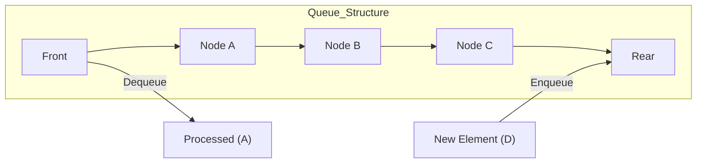

# Queue

A Queue is a linear data structure that follows the **FIFO (First In, First Out)** principle. In a queue, elements are added at the back (rear) and removed from the front. This is analogous to a real-life line: the first person to enter the line is the first one to be served.

## Key Aspects

- **Why is this relevant?** Queues are fundamental for managing tasks that must be processed in the order they arrived. They are used in operating system scheduling (CPU, disk), print spoolers, handling asynchronous data transfer, and implementing Breadth-First Search (BFS).
- **Related Concepts:** [[Stack]], [[Linked Lists]], [[Arrays]].
- **Patterns:**
    - **Breadth-First Search (BFS):** Using a queue to explore nodes level-by-level in a tree or graph.
    - **Producer-Consumer Pattern:** Buffering data between processes that produce and consume at different rates.
    - **Circular Queue:** Using a fixed-size array where the last position wraps around to the first to save space.
- **Analogy:** Imagine a **checkout line** at a grocery store. The first person to join the line is the first to check out. New customers join the end of the line.
- **Best Practices:**
    - Use a [[Linked Lists]] for O(1) dequeue operations, as using an [[Arrays]] would require shifting all other elements (O(n)).
    - Consider **Priority Queues** if tasks have different levels of importance (often implemented with a [[Heap Sort]]).

## Fundamentals

- **Enqueue:** Add an element to the rear of the queue.
- **Dequeue:** Remove the element from the front of the queue.
- **Peek (or Front):** View the element at the front without removing it.
- **IsEmpty:** Check if the queue is empty.

## Specifications

| Operation | Average Complexity | Worst Case Complexity |
| :--- | :--- | :--- |
| Enqueue | O(1) | O(1) |
| Dequeue | O(1) | O(1) |
| Peek | O(1) | O(1) |
| Search | O(n) | O(n) |
| Space | O(n) | O(n) |

## Implementation (using Linked List)

```ts
class QueueNode<T> {
    value: T;
    next: QueueNode<T> | null = null;
    constructor(value: T) { this.value = value; }
}

class Queue<T> {
    private head: QueueNode<T> | null = null;
    private tail: QueueNode<T> | null = null;
    private length: number = 0;

    enqueue(value: T): void {
        const newNode = new QueueNode(value);
        if (!this.tail) {
            this.head = this.tail = newNode;
        } else {
            this.tail.next = newNode;
            this.tail = newNode;
        }
        this.length++;
    }

    dequeue(): T | undefined {
        if (!this.head) return undefined;
        
        const value = this.head.value;
        this.head = this.head.next;
        if (!this.head) this.tail = null;
        
        this.length--;
        return value;
    }

    peek(): T | undefined {
        return this.head?.value;
    }
}
```

## Conceptual Diagram: FIFO Principle


