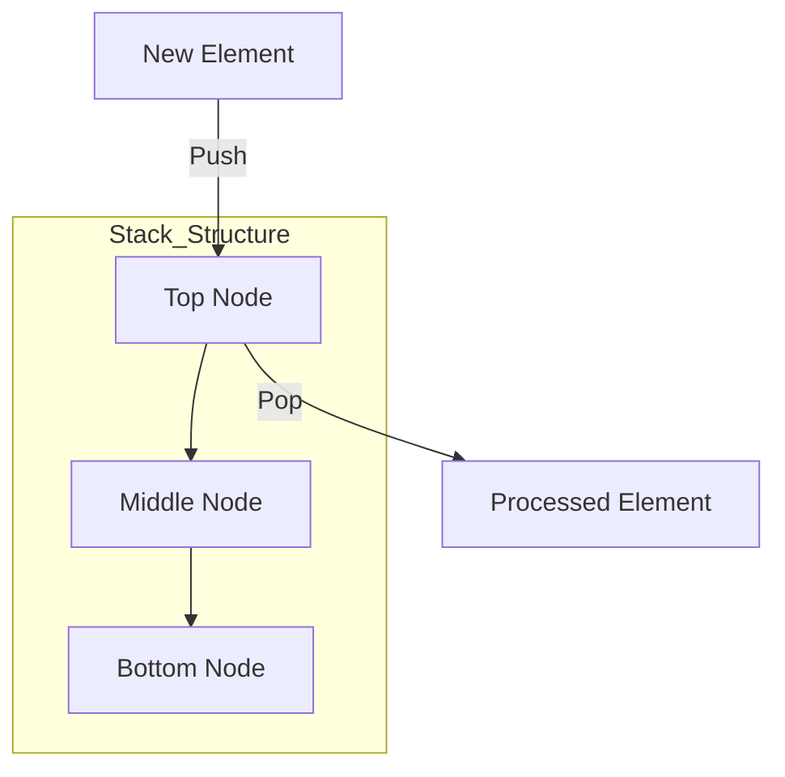

# Stack

A Stack is a linear data structure that follows the **LIFO (Last In, First Out)** principle. In a stack, elements are added and removed from the same end, commonly referred to as the **top**. The last element added to the stack is the first one to be removed.

## Key Aspects

- **Why is this relevant?** Stacks are fundamental for managing function calls (the **call stack**), undo/redo functionality in software, expression evaluation (like parsing math), and backtracking algorithms like Depth-First Search (DFS).
- **Related Concepts:** [[Queue]], [[Linked Lists]], [[Recursion]].
- **Patterns:**
    - **Balanced Parentheses:** Using a stack to check if opening and closing delimiters match.
    - **Reverse Polish Notation (RPN):** Evaluating postfix mathematical expressions.
    - **Backtracking:** Storing state to return to a previous point in a search.
- **Analogy:** Imagine a **stack of dinner plates**. You can only place a new plate on the very top, and you can only remove the plate that is currently on the top. To get to the bottom plate, you must remove all the plates above it.
- **Best Practices:**
    - Use a stack when you need to process elements in the exact reverse order of their arrival.
    - Be mindful of **Stack Overflow** in recursive functions, which occurs when the system's call stack exceeds its capacity.

## Fundamentals

- **Push:** Add an element to the top of the stack.
- **Pop:** Remove the element from the top of the stack.
- **Peek (or Top):** View the element at the top without removing it.
- **IsEmpty:** Check if the stack is empty.

## Specifications

| Operation | Average Complexity | Worst Case Complexity |
| :--- | :--- | :--- |
| Push | O(1) | O(1)* |
| Pop | O(1) | O(1) |
| Peek | O(1) | O(1) |
| Search | O(n) | O(n) |
| Space | O(n) | O(n) |

*\*Amortized O(1) if implemented with a dynamic array.*

## Implementation (using Array)

```ts
class Stack<T> {
    private items: T[] = [];

    push(item: T): void {
        this.items.push(item);
    }

    pop(): T | undefined {
        return this.items.pop();
    }

    peek(): T | undefined {
        return this.items[this.items.length - 1];
    }

    isEmpty(): boolean {
        return this.items.length === 0;
    }

    size(): number {
        return this.items.length;
    }
}
```

## Conceptual Diagram: LIFO Principle


