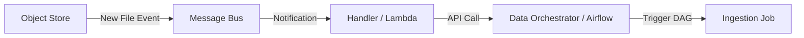

**Context:** Data arrives irregularly (event-driven). Running a scheduled cron job results in wasted resources checking for data that isn't there.

**Solution:** Use an event-driven architecture. The arrival of data (e.g., file landing in S3) triggers a notification (EventBridge/Lambda) which then triggers the orchestration pipeline (Airflow DAG).

**Challenges:**

- **Push vs Pull:** Push is generally more efficient than long-polling sensors.
- **Context:** Ensure the trigger passes relevant metadata (execution date, file path) so the pipeline knows what to process.

**Event-Driven Flow**



**Python/Lambda Handler for Airflow**

```python
import json
import requests
import urllib.parse

def lambda_handler(event, ctx):
    # Extract file info from event
    file_key = urllib.parse.unquote_plus(
        event['Records'][0]['s3']['object']['key'], encoding='utf-8'
    )
    
    payload = {
        'conf': {
            'file_to_load': file_key,
            'trigger_source': 'lambda'
        }
    }
    
    # Trigger Airflow DAG via API
    response = requests.post(
        'http://airflow-host:8080/api/v1/dags/devices-loader/dagRuns',
        data=json.dumps(payload),
        auth=('user', 'pass'),
        headers={'Content-Type': 'application/json'}
    )
    
    if response.status_code != 200:
        raise Exception(f"Failed to trigger DAG: {response.text}")
        
    return True
```