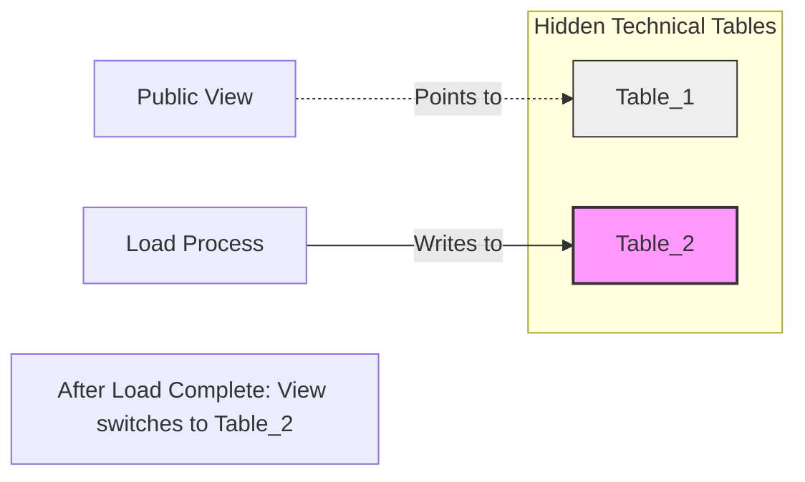

**Context:** When you need to ingest a complete dataset every time, such as for database bootstrapping or loading slowly changing reference data where row-level changes cannot be easily identified.

**Solution:** Implement an Extract-Load (EL) or Extract-Transform-Load (ETL) pipeline that overwrites the destination with the full source dataset. This is best for homogeneous stores or when simple format changes are needed.

**Challenges:**

- **Data Volume:** Static compute resources may fail if data grows significantly.
- **Consistency:** Consumers might read partial data during the overwrite. Use transactions or a single data exposition abstraction (like a database view) to switch references atomically.

**Diagram: Data Exposition Abstraction**

Code snippet



**Code Example (Python/Spark):**

Python

```python
# Reading input and overwriting the destination table (Delta Lake handles transaction)
input_data = spark.read.schema(input_data_schema).json("s3://devices/list")
input_data.write.format("delta").mode("overwrite").save("s3://master/devices")
```

**Code Example (SQL - Versioned View Switching):**

SQL

```SQL
-- Step 1: Load to versioned table
COPY devices_${version} FROM '/data_to_load/dataset.csv' CSV DELIMITER ';' HEADER;

-- Step 2: Update view to point to new version
CREATE OR REPLACE VIEW devices AS SELECT * FROM devices_${version};
```