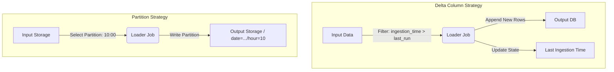

**Context:** Continuously growing datasets where processing the full history is too expensive or slow.

**Solution:** Ingest only the data that has changed or been added since the last execution.

- **Delta Column Implementation:** Uses a watermark column (e.g., `ingestion_time`) to filter rows > last processed time.
- **Partition-based Implementation:** Ingests distinct time-based partitions (e.g., hourly folders).

**Challenges:**

- **Hard Deletes:** Physically deleted rows in the source are missed unless "soft deletes" (flags) are used.
- **Backfilling:** reprocessing old data might trigger full loads unless time boundaries are enforced.

**Diagram: Implementation Strategies**

Code snippet



**Code Example (Python/Spark - Delta Column):**

Python

```python
# Reading with a filter for the specific time range
in_data = (spark_session.read.text(input_path).select('value',
           functions.from_json(functions.col('value'), 'ingestion_time TIMESTAMP')))

# Filter for incremental data
input_to_write = in_data.filter(
    f'ingestion_time BETWEEN "{date_from}" AND "{date_to}"'
)

input_to_write.mode('append').select('value').write.text(output_path)
```

**Code Example (CLI - Partition Sync):**

Bash

```sh
aws s3 sync "s3://input/date=2024-01-01" "s3://output/date=2024-01-01" --delete
```