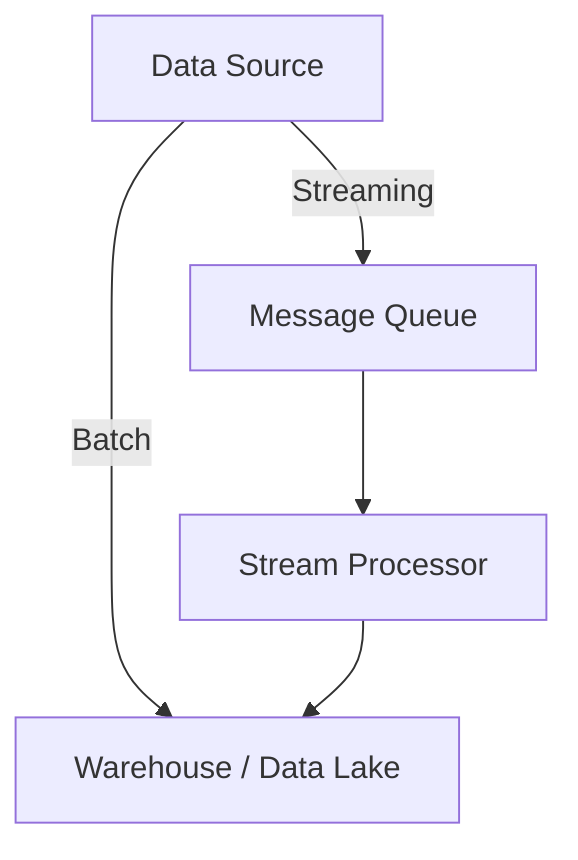
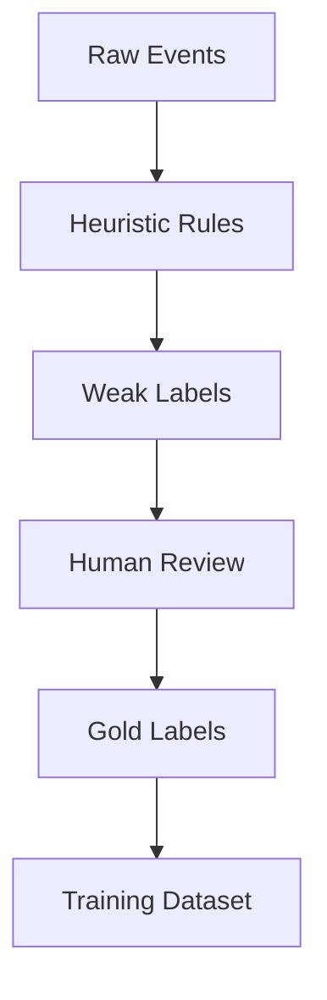
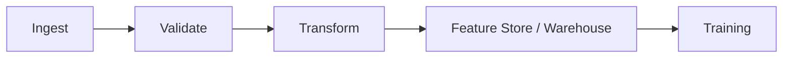

## 1. Role of Data Engineering in ML Systems

In production ML, data engineering is responsible for:

- **Reliability**: correct, reproducible inputs to models   
- **Scalability**: handling growth in volume, velocity, and schema
- **Adaptability**: enabling retraining and iteration as data drifts
- **Observability**: detecting data quality and distribution issues early

In Chip Huyen’s system lifecycle, data engineering is the _first irreversible decision_: once data contracts are established, downstream modeling choices are constrained.

---

## 2. Data Sources and Ingestion Patterns

### 2.1 Common Data Sources

|Source Type|Examples|ML Implications|
|---|---|---|
|Operational DBs|Postgres, MySQL|Normalized, not model-friendly|
|Warehouses|Snowflake, BigQuery|Batch-first, analytics-ready|
|Event Streams|Kafka, Kinesis|Ordering, late arrivals|
|Third-party APIs|Payments, ads|Schema volatility|

### 2.2 Ingestion Modes



**Key ML-specific concern**: _ingestion-time correctness beats ingestion-time speed_. Silent corruption propagates.

---

## 3. Data Schemas, Contracts, and Versioning

### 3.1 Why Schemas Matter More in ML

- Features are **code + data artifacts**
- Schema drift silently breaks model assumptions
- Backward-incompatible changes invalidate historical training data

### 3.2 Practical Data Contract Example

```python
from pydantic import BaseModel, Field
from datetime import datetime

class TransactionEvent(BaseModel):
    user_id: str
    amount: float = Field(gt=0)
    currency: str
    timestamp: datetime
```

**Production insight**:

- Treat schemas as **APIs**    
- Breaking changes require retraining, not just redeploying code

---

## 4. Data Quality Dimensions (ML-Oriented)

Traditional DE checks are insufficient. ML systems require **distributional guarantees**.

|Dimension|Example Failure|
|---|---|
|Completeness|Missing labels spike|
|Validity|Feature outside training range|
|Consistency|Same entity, conflicting records|
|Timeliness|Stale data fed to retraining|
|Distributional Stability|Feature drift|

### 4.1 Simple Distribution Check

```python
import numpy as np

def population_stability_index(expected, actual, bins=10):
    expected_hist, _ = np.histogram(expected, bins=bins)
    actual_hist, _ = np.histogram(actual, bins=bins)

    expected_pct = expected_hist / expected_hist.sum()
    actual_pct = actual_hist / actual_hist.sum()

    psi = np.sum(
        (actual_pct - expected_pct) *
        np.log((actual_pct + 1e-6) / (expected_pct + 1e-6))
    )
    return psi
```

**Interpretation**:

- PSI < 0.1 → stable
- 0.1–0.25 → moderate shift
- > 0.25 → retraining candidate

---

## 5. Batch Data Processing for ML

In the referenced pipeline, **Spark is the default transformation engine** .

### 5.1 Why Spark Is Common in ML Pipelines

- Deterministic batch recomputation
- Horizontal scaling
- Schema-aware transformations
- Easy integration with Airflow and Kubernetes

### 5.2 Feature-Oriented Transformation Example (PySpark)

```python
from pyspark.sql import functions as F

features = (
    transactions
    .groupBy("user_id")
    .agg(
        F.count("*").alias("txn_count"),
        F.sum("amount").alias("total_spend"),
        F.avg("amount").alias("avg_spend"),
        F.max("timestamp").alias("last_txn_ts")
    )
)
```

**ML insight**:

- Feature computation must be **idempotent**
- Recomputable from raw data at any point in time

---

## 6. Sampling and Dataset Construction

### 6.1 Why Sampling Is an ML Decision

Sampling affects:

- Class balance   
- Temporal leakage
- Feature availability
- Model bias

### 6.2 Time-Aware Train / Validation / Test Split

```python
import pandas as pd

df = df.sort_values("event_time")

train = df[df.event_time < "2024-01-01"]
val   = df[(df.event_time >= "2024-01-01") & (df.event_time < "2024-02-01")]
test  = df[df.event_time >= "2024-02-01"]
```

**Never random-split temporal data** unless the prediction target is truly time-invariant.

---

## 7. Label Generation Pipelines

Labels are often:

- Delayed
- Noisy
- Derived from heuristics
- Changed retroactively

### 7.1 Example: Label Backfill Job



**Key insight from Chip Huyen**:

> Labels are not ground truth; they are _approximations with cost_.

---

## 8. Data Lineage and Reproducibility

For ML, reproducibility requires:

- Raw data version
- Transformation code version
- Feature schema version
- Label logic version

### 8.1 Minimal Lineage Metadata Example

```python
metadata = {
    "raw_data_snapshot": "snowflake.sales@2024-02-01",
    "feature_code_commit": "a9f3c12",
    "label_logic_version": "v3.1",
    "schema_hash": "e4c91d"
}
```

Without this, **model performance regressions are un-debuggable**.

---

## 9. Orchestration Boundaries (Airflow Mental Model)

From _Machine Learning Pipeline.pdf_ :



**Airflow orchestrates tasks; Spark executes data logic.**  
Avoid mixing concerns.

---

## 10. Failure Modes Specific to Data Engineering in ML

|Failure|Symptom|
|---|---|
|Silent schema drift|Gradual accuracy decay|
|Label leakage|Unrealistic offline metrics|
|Feature skew|Online ≠ offline performance|
|Stale data|Concept drift masked|
|Non-idempotent jobs|Non-reproducible models|
