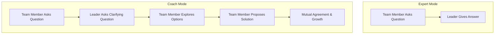

Coaching is a leadership style focused on helping individuals develop their skills and reach their full potential through guidance, feedback, and inquiry. It is the shift from being the "expert" who provides answers to the "guide" who asks the right questions to empower others to find solutions.

Key Aspects:
- **Why is this concept relevant?**
    - **Scalability:** An engineering leader who solves every problem becomes a bottleneck. Coaching creates a self-sufficient team.
    - **Career Growth:** High-performing engineers value mentorship and growth opportunities. Effective coaching is key to retention.
    - **Innovation:** Encourages team members to think critically and come up with their own technical solutions.
- **What ideas does the concept relate to?**
    - [[mentorship/Delegation|Delegation]]
    - [[mentorship/Empathy|Empathy]]
    - [[communication/Active Listening|Active Listening]]
    - Growth Mindset
- **Patterns to assist in understanding:**
    - **The GROW Model:** A structured coaching framework:
        - **G**oal: What do you want to achieve?
        - **R**eality: What is the current situation?
        - **O**ptions: What could you do?
        - **W**ay Forward: What *will* you do?
    - **The Socratic Questioning Pattern:** Asking open-ended questions (Who, What, Where, When, How) instead of giving "Yes/No" answers or directives.
- **Analogy:**
    - Coaching is like **Pair Programming**, but with a focus on the *person* rather than the *code*. You aren't taking the keyboard (the problem-solving); you're sitting beside them, helping them think through the logic and identify their own bugs in thinking.
- **Best Practices:**
    - Listen more than you speak.
    - Focus on the *process* of problem-solving, not just the *output*.
    - Provide specific, timely, and actionable feedback (positive and constructive).
    - Establish regular 1-on-1s dedicated to development, not just status updates.

Fundamentals or Prerequisites:
- [[communication/Active Listening|Active Listening]]
- [[mentorship/Empathy|Empathy]]
- Emotional Intelligence (EQ)

Conceptual Diagram: Coaching Transition

