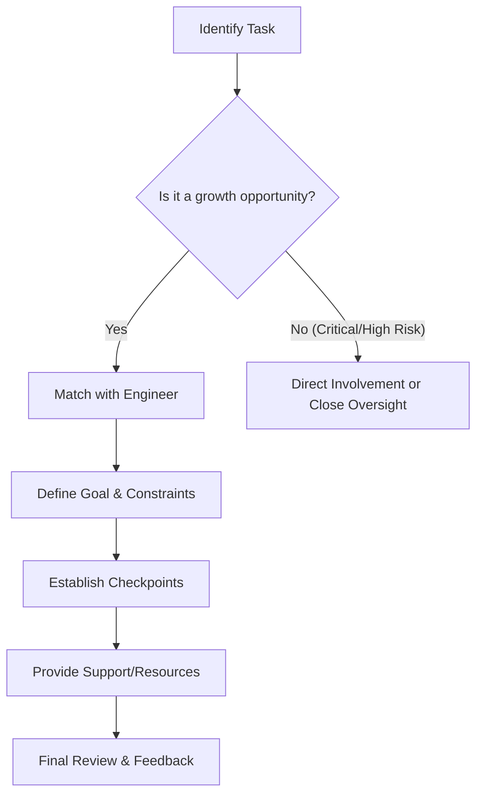

Delegation is the process of entrusting tasks, responsibilities, or authority to others. In engineering leadership, it is a strategic tool for scaling teams, developing talent, and ensuring that the leader can focus on higher-level strategy and organizational alignment.

Key Aspects:
- **Why is this concept relevant?**
    - **Avoiding Bottlenecks:** A leader who insists on making every technical decision slows down the entire team.
    - **Skill Development:** Delegating challenging tasks provides growth opportunities for engineers to build new skills and gain autonomy.
    - **Strategic Focus:** Freeing up the leader's time allows them to focus on [[strategy/Prioritization|Prioritization]] and [[communication/Stakeholder Management|Stakeholder Management]].
- **What ideas does the concept relate to?**
    - [[mentorship/Coaching|Coaching]]
    - [[mentorship/Empathy|Empathy]]
    - [[strategy/Prioritization|Prioritization]]
    - Autonomy, Mastery, and Purpose
- **Patterns to assist in understanding:**
    - **The Levels of Delegation:** Recognizing that delegation isn't all-or-nothing.
        - *Level 1: Do as I say.* (Direct command)
        - *Level 2: Research and report.* (Investigate, then report back)
        - *Level 3: Recommend and act.* (Analyze, suggest, and execute after approval)
        - *Level 4: Decide and act.* (Full autonomy)
    - **The Outcome-Based Delegation Pattern:** Focusing on *what* needs to be achieved (the goal) rather than *how* to do it (the implementation).
- **Analogy:**
    - Delegation is like **asynchronous function calls** or **message queues**. You "dispatch" a task to another "worker" (team member) and continue with your other processes. You don't block and wait for every single step of their execution. You only need the "callback" (final result or update) once they're done.
- **Best Practices:**
    - Be clear about the goal, scope, and definition of "done."
    - Provide the necessary resources and authority to succeed.
    - Establish clear checkpoints for follow-up without micromanaging.
    - Match the level of delegation to the individual's skill and experience.

Fundamentals or Prerequisites:
- Trust
- [[communication/Active Listening|Active Listening]]
- [[strategy/Prioritization|Prioritization]]

Conceptual Diagram: Delegation Framework

