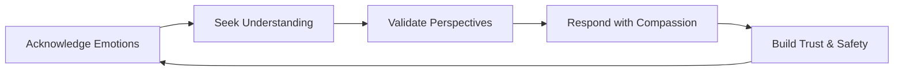

Empathy is the ability to understand and share the feelings and perspectives of another person. In engineering leadership, it is not just "being nice"; it is a strategic tool for building trust, improving collaboration, and navigating the complexities of human-centric technical environments.

Key Aspects:
- **Why is this concept relevant?**
    - **Conflict Resolution:** Understanding the *why* behind a team member's behavior or disagreement helps in de-escalating conflicts and finding common ground.
    - **Psychological Safety:** When people feel understood, they are more likely to admit mistakes and share risks, which is critical for system reliability.
    - **Informed Decision-Making:** Empathy helps leaders understand the *impact* of technical decisions (e.g., a stressful on-call rotation or a difficult refactoring task) on their team members' well-being.
- **What ideas does the concept relate to?**
    - [[mentorship/Coaching|Coaching]]
    - [[communication/Active Listening|Active Listening]]
    - Emotional Intelligence (EQ)
    - Psychological Safety
- **Patterns to assist in understanding:**
    - **Cognitive Empathy Pattern:** Thinking through someone else's logical perspective ("If I were responsible for the uptime of this service, why would I be concerned about this change?").
    - **Affective Empathy Pattern:** Recognizing and responding to someone's emotional state ("I can see that this outage has been incredibly stressful for you; let's talk about it.").
    - **Self-Awareness Pattern:** Recognizing how your own emotions and biases influence your leadership style and decisions.
- **Analogy:**
    - Empathy is like **instrumentation and observability** for your team. You don't just look at the "up/down" status (the final output); you look at the internal state (the feelings and perspectives) to understand *why* the system (the team) is behaving the way it is. Without empathy, you are flying blind with no logs or metrics for your most important resource: your people.
- **Best Practices:**
    - Practice [[communication/Active Listening|Active Listening]].
    - Be aware of your own biases and assumptions.
    - Ask questions rather than making assumptions about someone's feelings.
    - Validate others' perspectives even if you don't agree with them.

Fundamentals or Prerequisites:
- [[communication/Active Listening|Active Listening]]
- Emotional Intelligence (EQ)
- Vulnerability

Conceptual Diagram: The Empathy Cycle

