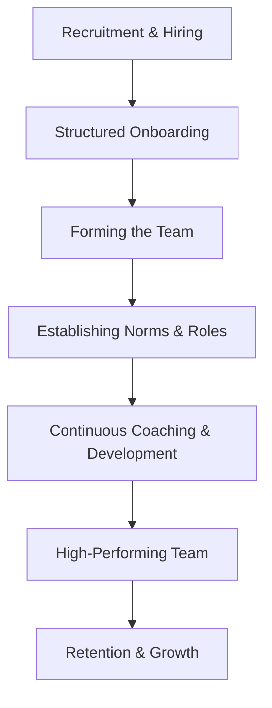

Team building is the strategic process of recruiting, onboarding, and forming well-structured, cross-functional teams that are aligned with business goals and capable of delivering high-quality technical solutions. It is about creating a cohesive unit from a group of individuals.

Key Aspects:
- **Why is this concept relevant?**
    - **Efficiency:** A well-built team with clear roles and complementary skills delivers more than the sum of its parts.
    - **Retention:** People stay in teams where they feel a sense of belonging and contribution.
    - **Scalability:** Strong team structures (like the Spotify model or Two-Pizza Teams) are essential for organizational growth.
- **What ideas does the concept relate to?**
    - [[mentorship/Empathy|Empathy]]
    - [[mentorship/Coaching|Coaching]]
    - [[mentorship/Delegation|Delegation]]
    - Psychological Safety
- **Patterns to assist in understanding:**
    - **Tuckman's Stages of Group Development:** Understanding that every team goes through a predictable lifecycle:
        - **Forming:** High uncertainty, testing the waters.
        - **Storming:** Conflict over goals and roles.
        - **Norming:** Developing trust and working standards.
        - **Performing:** High collaboration and effectiveness.
        - **Adjourning:** Wrapping up and disbanding (for project-based teams).
    - **The Cross-Functional Pattern:** Building teams with all the skills needed to deliver a feature end-to-end (Frontend, Backend, Design, Product).
- **Analogy:**
    - Team building is like **system architecture and service-oriented design**. Each "service" (team member) has specific responsibilities and interfaces. You need to ensure the "network" (communication channels) is robust, the "load balancing" (resource allocation) is fair, and the "integration" (collaboration) is seamless to prevent system failures (team burnout or project delays).
- **Best Practices:**
    - Hire for both technical skills and culture/values alignment.
    - Invest in a structured onboarding process that covers both technical setup and social integration.
    - Define clear roles, responsibilities, and decision-making processes early on.
    - Create opportunities for team bonding beyond just work tasks.

Fundamentals or Prerequisites:
- [[mentorship/Empathy|Empathy]]
- [[mentorship/Coaching|Coaching]]
- Strategic Alignment

Conceptual Diagram: Team Building Lifecycle

