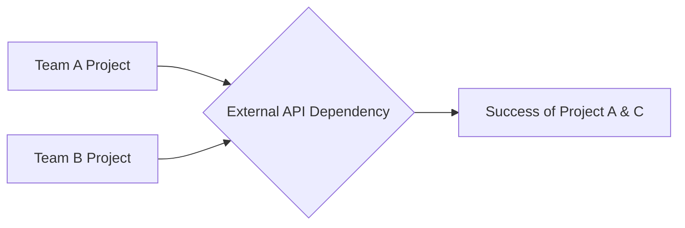

Managing dependencies is the practice of identifying, tracking, and mitigating the impact of factors that are outside the direct control of a project or team but are required for its successful completion. In engineering, this often includes technical dependencies (e.g., external APIs, legacy systems) and organizational dependencies (e.g., cross-team collaboration).

Key Aspects:
- **Why is this concept relevant?**
    - **Prevents Delays:** Unmanaged dependencies are a primary cause of project delays and missed deadlines.
    - **Reduces Risk:** Identifying dependencies early allows the team to plan for potential blockers and develop mitigation strategies.
    - **Improves Predictability:** Understanding the full scope of requirements (including those outside the team's control) leads to more accurate project planning and communication with stakeholders.
- **What ideas does the concept relate to?**
    - [[strategy/Prioritization|Prioritization]]
    - [[project management/Risk Assessment|Risk Assessment]]
    - [[communication/Stakeholder Management|Stakeholder Management]]
    - Critical Path Analysis
- **Patterns to assist in understanding:**
    - **The Dependency Map Pattern:** Visualizing the connections between projects, teams, and technical components to identify potential bottlenecks.
    - **The Early Engagement Pattern:** Proactively communicating with other teams or stakeholders as soon as a dependency is identified.
    - **The Mitigation Pattern:** Developing "Plan B" options (e.g., mocking an API, using a placeholder component) in case a dependency is delayed.
- **Analogy:**
    - Managing dependencies is like **planning a multi-stage relay race**. You (the team) can run your leg of the race perfectly (your part of the project), but if the runner before you doesn't pass the baton (the dependency), you can't start your leg and you'll lose the race (the project will be delayed). You need to know exactly who is passing you the baton, when they'll be there, and what to do if they're running late.
- **Best Practices:**
    - Identify all dependencies during the project planning phase.
    - Document each dependency (who is responsible, what is required, when it's needed).
    - Establish clear communication channels with all dependent teams or stakeholders.
    - Track and review dependency status regularly.

Fundamentals or Prerequisites:
- [[strategy/Prioritization|Prioritization]]
- [[communication/Stakeholder Management|Stakeholder Management]]
- [[project management/Risk Assessment|Risk Assessment]]

Conceptual Diagram: Dependency Chain

