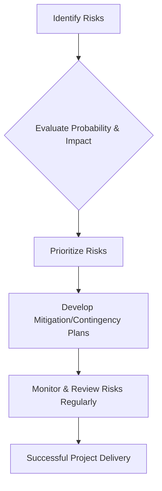

Risk assessment is the process of identifying, evaluating, and prioritizing potential risks that could impact the success of a project or team. In engineering, this includes technical risks (e.g., security vulnerabilities, performance bottlenecks), organizational risks (e.g., resource shortages), and external risks (e.g., market changes, vendor failures).

Key Aspects:
- **Why is this concept relevant?**
    - **Informed Decision-Making:** Helps leaders make choices based on a clear understanding of potential negative outcomes.
    - **Resource Allocation:** Prioritizes effort and resources toward mitigating the most significant risks.
    - **Increased Resilience:** Prepares the team to respond effectively to unexpected challenges.
- **What ideas does the concept relate to?**
    - [[strategy/Prioritization|Prioritization]]
    - [[project management/Managing Dependencies|Managing Dependencies]]
    - [[communication/Translating Tech to Business|Translating Tech to Business]]
    - Security Vulnerability Management
- **Patterns to assist in understanding:**
    - **The Risk Impact/Probability Matrix:** Evaluating risks based on their likelihood of occurring and their potential impact on the project.
    - **The Mitigation vs. Contingency Pattern:**
        - **Mitigation:** Actions taken to *reduce* the likelihood or impact of a risk before it occurs.
        - **Contingency:** Plans put in place to *respond* to a risk if it does occur.
    - **The Risk Log Pattern:** Maintaining a central document to track identified risks, their status, and mitigation plans.
- **Analogy:**
    - Risk assessment is like **checking the weather and your car's condition before a long road trip**. You identify potential problems (e.g., a storm, a worn-out tire) and take action (e.g., pack an umbrella, replace the tire) to prevent them from ruining your trip. You also have a plan for what to do if a problem *does* occur (e.g., a spare tire, a list of roadside assistance numbers).
- **Best Practices:**
    - Conduct risk assessments early and often during the project lifecycle.
    - Involve the entire team in identifying potential risks.
    - Be realistic about both the likelihood and impact of each risk.
    - Document and communicate all risks and mitigation plans clearly to stakeholders.

Fundamentals or Prerequisites:
- [[strategy/Prioritization|Prioritization]]
- [[project management/Managing Dependencies|Managing Dependencies]]
- Strategic Thinking

Conceptual Diagram: Risk Assessment Workflow

