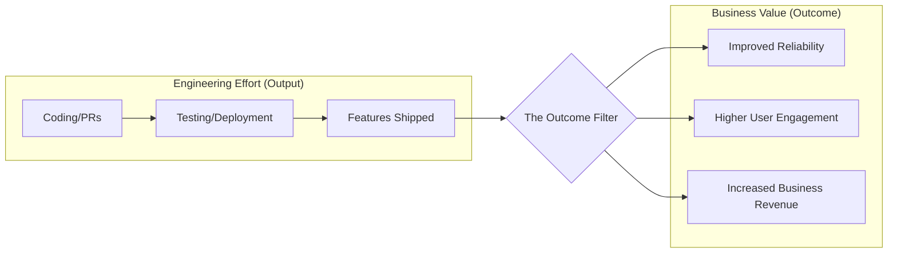

Measuring outcomes is the practice of evaluating engineering performance and success based on the value delivered to the business and customers (impact), rather than the volume of work performed (output). This shift is critical for aligning engineering efforts with organizational goals and ensuring sustainable growth.

Key Aspects:
- **Why is this concept relevant?**
    - **Avoids Busy Work:** Measuring output (like lines of code or number of PRs) can incentivize work that doesn't actually add value.
    - **Strategic Alignment:** Outcome-based metrics (like revenue impact, user retention, or system reliability) ensure engineering is focused on what matters most to the business.
    - **Continuous Improvement:** Provides a clearer signal on whether technical changes are actually achieving their intended goals.
- **What ideas does the concept relate to?**
    - [[strategy/Prioritization|Prioritization]]
    - [[communication/Translating Tech to Business|Translating Tech to Business]]
    - OKRs (Objectives and Key Results)
    - DORA Metrics (Deployment Frequency, Lead Time, Mean Time to Recover, Change Failure Rate)
- **Patterns to assist in understanding:**
    - **The North Star Metric Pattern:** Identifying a single key metric that represents the primary value delivered by the product or team (e.g., Daily Active Users, Checkout Conversion Rate).
    - **The Output vs. Outcome Framework:**
        - **Output:** Features shipped, bugs fixed, lines of code, PR count.
        - **Outcome:** Reduced user churn, increased performance (latency), improved system uptime (SLAs), higher developer velocity.
    - **The DORA Pattern:** Using industry-standard metrics to measure the *process* of delivering value, which indirectly measures the effectiveness of the team.
- **Analogy:**
    - Measuring outcomes is like **judging a chef by the taste and popularity of their food** (the outcome), rather than the **number of onions they chopped or the number of dishes they washed** (the output). You can chop a lot of onions (output) and still produce a mediocre meal (no outcome). The business and the customers only care about the final meal.
- **Best Practices:**
    - Define clear objectives (OKRs) that are tied to business goals.
    - Use a mix of leading indicators (predict future success, like test coverage) and lagging indicators (measure past success, like revenue).
    - Avoid "vanity metrics" that look good but don't provide actionable insights.
    - Communicate outcomes to stakeholders in [[communication/Translating Tech to Business|Business Language]].

Fundamentals or Prerequisites:
- [[communication/Translating Tech to Business|Translating Tech to Business]]
- Basic understanding of business KPIs and OKRs.
- [[strategy/Prioritization|Prioritization]]

Conceptual Diagram: Output to Outcome Pipeline

