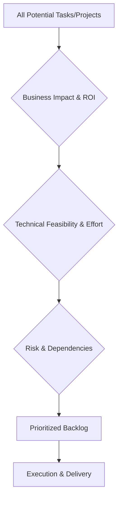

Prioritization is the strategic process of determining the order and importance of engineering tasks, projects, and goals based on their impact, feasibility, and risk. In engineering leadership, effective prioritization ensures that limited resources (time, talent, budget) are directed toward the most valuable outcomes.

Key Aspects:
- **Why is this concept relevant?**
    - **Resource Constraints:** There is always more work to be done than there is time or people to do it.
    - **Focus:** Prevents the team from being spread too thin and ensures they are working on what matters most to the business.
    - **Predictability:** Setting clear priorities helps in defining realistic timelines and managing stakeholder expectations.
- **What ideas does the concept relate to?**
    - [[strategy/Measuring Outcomes|Measuring Outcomes]]
    - [[project management/Risk Assessment|Risk Assessment]]
    - [[project management/Managing Dependencies|Managing Dependencies]]
    - Opportunity Cost
- **Patterns to assist in understanding:**
    - **The MoSCoW Method:** Categorizing tasks into:
        - **M**ust have (critical)
        - **S**hould have (important but not critical)
        - **C**ould have (nice to have)
        - **W**on't have (not this time)
    - **The Eisenhower Matrix:** Organizing tasks by urgency and importance (Do, Decide, Delegate, Delete).
    - **The RICE Framework:** Scored based on **R**each, **I**mpact, **C**onfidence, and **E**ffort.
- **Analogy:**
    - Prioritization is like **choosing the items for your travel suitcase**. You only have a limited amount of space (the team's capacity). If you try to pack everything, the suitcase won't close (the team will burn out or miss deadlines). You must decide what's essential for your destination (the business goal) and leave the rest behind.
- **Best Practices:**
    - Align priorities with business goals and stakeholder expectations.
    - Re-evaluate priorities regularly (e.g., during sprint planning or quarterly reviews).
    - Be transparent about why certain tasks were prioritized over others.
    - Consider technical debt and long-term scalability in your prioritization.

Fundamentals or Prerequisites:
- [[communication/Translating Tech to Business|Translating Tech to Business]]
- [[strategy/Measuring Outcomes|Measuring Outcomes]]
- [[project management/Risk Assessment|Risk Assessment]]

Conceptual Diagram: Prioritization Funnel

